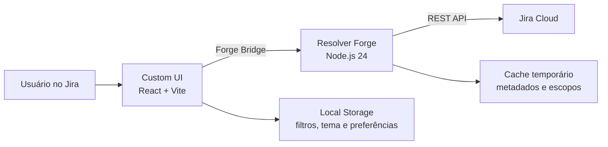

<div align="center">

# 📊 Omni Team Reports

### Indicadores operacionais, gestão de equipes e desempenho individual dentro do Jira Cloud.

[](./package.json)
[](https://developer.atlassian.com/platform/forge/)
[](https://react.dev/)
[](./manifest.yml)
[](./static/dashboard/test)

Uma visão única para acompanhar cards, story points, horas, QA, aprovações, reprovações e produtividade sem sair do Jira.

[Contribuidores](#-contribuidores--homenagem-aos-nossos-qas) · [Funcionalidades](#-funcionalidades) · [Arquitetura](#-arquitetura) · [Instalação](#-instalação) · [Desenvolvimento](#-desenvolvimento) · [Deploy](#-deploy) · [Problemas comuns](#-problemas-comuns)

</div>

---

## 🤝 Contribuidores — homenagem aos nossos QAs

O Omni Team Reports também é construído com a colaboração de quem testa, valida e ajuda a encontrar problemas no dia a dia.

### 🧪 Quality Assurance

| QA | Contribuições |
| --- | --- |
| [Willian Bruno](https://github.com/Willian-Bruno) | 🐛 Bug reports · 🧪 Testes e validações |
| [Victoria Kamilly](https://github.com/VictoriaKamilly) | 🐛 Bug reports · 🧪 Testes e validações |

> A contribuição com o projeto vai além de código. Testes, validações, identificação de bugs e abertura de issues também fazem parte da evolução do Omni Team Reports.

---

## 💡 Sobre o projeto

O **Omni Team Reports** é um aplicativo Atlassian Forge com uma página global no Jira. Ele transforma dados de cards, sprints e worklogs em relatórios operacionais e gerenciais, mantendo as permissões e a autenticação sob responsabilidade do próprio Forge.

O painel foi pensado para responder rapidamente perguntas como:

- Quem está trabalhando em quais cards?
- Quantos story points cada pessoa acumulou como responsável ou QA?
- Quantas horas foram apontadas no período?
- Quais cards foram concluídos, impedidos, aprovados ou reprovados?
- Como está o desempenho individual do usuário logado?
- Como exportar os dados gerenciais em uma planilha organizada?

> [!NOTE]
> A versão em execução aparece no cabeçalho do painel. Isso facilita confirmar se uma instalação já recebeu a publicação mais recente.

## ✨ Funcionalidades

| Área | O que oferece |
| --- | --- |
| **Indicadores** | Métricas, ranking, calendário de trabalho e cards agrupados por colaborador ou status. |
| **Gestão** | Visão de todo o escopo com seleção múltipla de colaboradores, filtros e comparativos. |
| **Exportar Excel** | Seleção e reordenação visual das colunas, prévia dos dados e download em XLSX real. |
| **Meu perfil** | Desempenho do usuário logado, cards, QA, story points, horas, qualidade e histórico de apontamentos. |
### Indicadores e calendário

- Seleção de um ou vários colaboradores.
- Totais unificados de cards e story points para responsáveis e QAs.
- Cards trabalhados e story points dentro do período.
- Horas, aprovações, reprovações e impedimentos.
- Ranking com total geral.
- Calendário compacto e visualização semanal detalhada.
- Criação, edição e exclusão de apontamentos.

### Gestão

- Grade **Horas por Pessoa e Dia**, com total por colaborador e por dia, rolagem horizontal e nomes fixos.
- Pessoas selecionadas continuam visíveis com zero horas. **Buscar Colaborador** permite incluir quem não teve atividade no período.
- Dias úteis passados sem apontamento são destacados; dias futuros e fins de semana têm indicação neutra. Não é uma apuração de faltas: férias, feriados e jornada individual não são calculados.
- **Somente Dias Úteis** oculta sábado e domingo da grade; o total mantém todas as horas do período.
- A grade consulta a data dos worklogs, independentemente de atualizações posteriores nos cards. Respeita o quadro/projeto, sprint, JQL personalizado e filtros da Gestão. Falhas na consulta exibem erro e opção de tentar novamente, em vez de zeros.
- Filtro **Épico/Pai** na Gestão e no Meu Perfil, além de filtro e coluna opcional na exportação. Usa o pai direto do Jira (para uma subtarefa, a tarefa pai), com compatibilidade para Epic Link legado. Cards sem vínculo aparecem como **Sem Épico/Pai**.
- Relatórios salvos guardam o filtro Épico/Pai, pessoas incluídas na Gestão e a opção de dias úteis.
- Consulta gerencial independente da seleção lateral.
- Seleção múltipla de colaboradores.
- Filtros por status, projeto, sprint, categoria e card.
- Gráficos de horas por colaborador e cards por status.
- Comparativo por pessoa com cards, SP, horas e média por card.
- Filtros persistidos após atualizar o relatório.

### Meu perfil

- Identificação automática do usuário conectado ao Jira.
- Cards como responsável, QA ou apenas com apontamentos.
- Taxas de conclusão e aprovação.
- Média de story points por card e horas por dia ativo.
- Gráficos de status, pontos por projeto e horas diárias.
- Filtros próprios e persistentes.
- Histórico detalhado dos apontamentos com edição rápida.

### Exportação XLSX

- Arquivo `.xlsx` compatível com Excel, LibreOffice e Google Sheets.
- Cabeçalho formatado, filtros automáticos e primeira linha congelada.
- Valores numéricos preservados como números.
- Colunas selecionáveis e reordenáveis por drag and drop.
- Linha visual indicando a posição de soltura.

## 🧭 Filtros disponíveis

O escopo geral pode ser definido por:

- quadro ou espaço/projeto;
- sprint por seleção, nome ou ID;
- status;
- intervalo de datas;
- JQL personalizado.

Por padrão, o período começa na **segunda-feira** e termina na **sexta-feira** da semana atual. Os filtros gerais, gerenciais, pessoais e de exportação são mantidos no navegador para não serem perdidos ao atualizar o painel.

## 🏗 Arquitetura



- O front-end é uma **Custom UI** construída com React.
- O `@forge/bridge` comunica a interface com o resolver.
- O resolver consulta Jira REST API e Jira Software Agile API como o usuário atual.
- Metadados reutilizáveis são mantidos em cache temporário para reduzir consultas repetidas.
- O aplicativo não utiliza banco de dados próprio.
- Tokens e credenciais não são armazenados no repositório.

## 🧰 Tecnologias

- Atlassian Forge
- Node.js 24 no runtime Forge
- React 19
- Vite 7
- Forge Bridge e Forge Resolver
- Jira Cloud REST API
- `fflate` para geração leve de arquivos XLSX
- Node Test Runner para testes automatizados

## 📁 Estrutura do projeto

```text
omniteams/
├── manifest.yml
├── package.json
├── src/
│   └── resolvers/
│       └── index.js
└── static/
    └── dashboard/
        ├── src/
        │   ├── main.jsx
        │   ├── report-utils.js
        │   ├── styles.css
        │   └── xlsx-utils.js
        ├── test/
        │   ├── report-utils.test.js
        │   └── xlsx-utils.test.js
        ├── index.html
        ├── package.json
        └── vite.config.js
```

| Arquivo | Responsabilidade |
| --- | --- |
| `manifest.yml` | Página global, runtime, recursos e permissões Forge. |
| `src/resolvers/index.js` | Jira API, cache, normalização e construção dos relatórios. |
| `static/dashboard/src/main.jsx` | Componentes, filtros e fluxos da interface. |
| `static/dashboard/src/report-utils.js` | Regras compartilhadas de agregação e filtragem. |
| `static/dashboard/src/xlsx-utils.js` | Construção do arquivo XLSX. |
| `static/dashboard/src/styles.css` | Design responsivo, temas claro e escuro. |

## ✅ Pré-requisitos

- Git.
- Node.js compatível com o Forge CLI — recomendado Node.js 22 ou superior.
- Uma conta Atlassian com acesso ao Jira Cloud.
- Acesso como colaborador ao aplicativo Forge já registrado.
- Forge CLI autenticado.

## 🚀 Instalação

### 1. Clonar e instalar

```bash
git clone https://github.com/FlavysonFelipe314/omniteams.git
cd omniteams
npm run install:all
```

### 2. Autenticar no Forge

```bash
npx forge login
```

### 3. Validar o projeto

```bash
npm test
npm run build
npm run lint
```

### 4. Publicar em desenvolvimento

```bash
npx forge deploy --environment development
```

O `manifest.yml` já possui o ID do aplicativo existente.

> [!WARNING]
> Não execute `forge register`. Esse comando associaria o código a outro aplicativo Forge.

Para instalar o ambiente de desenvolvimento em um novo site:

```bash
npx forge install \
  --environment development \
  --site seu-site.atlassian.net \
  --product Jira
```

## 🛠 Desenvolvimento

| Comando | Descrição |
| --- | --- |
| `npm run install:all` | Instala dependências do resolver e do dashboard. |
| `npm test` | Executa os testes de relatórios e XLSX. |
| `npm run build` | Gera a Custom UI em `static/dashboard/dist`. |
| `npm run lint` | Executa as validações do Forge. |
| `npm run tunnel` | Gera o front-end e inicia o túnel Forge. |
| `npm run deploy` | Faz o build e publica no ambiente Forge padrão. |

O diretório `static/dashboard/dist` é gerado pelo build e não deve ser versionado.

### Logs do ambiente

```bash
npx forge logs --environment development
```

### Campos Jira reconhecidos

O app descobre campos customizados pelo nome, incluindo variações em português e inglês:

| Informação | Exemplos reconhecidos |
| --- | --- |
| Desenvolvimento | `Dev`, `Developer`, `Desenvolvedor` |
| Qualidade | `QA`, `Q.A`, `Tester`, `Homologador` |
| Reprovação | `Reprovação`, `Reprovações`, `Rejection` |
| Aprovação | `Aprovação`, `Aprovações`, `Approval` |
| Organização | `Categoria`, `Projeto`, `Sprint` |

Os story points utilizam os campos Jira conhecidos pelo projeto e são normalizados para uma única métrica chamada **SP**.

## 🔐 Permissões

As permissões ficam declaradas em `manifest.yml`:

| Scope | Uso |
| --- | --- |
| `read:jira-work` | Ler cards, campos e worklogs. |
| `write:jira-work` | Criar, editar e excluir apontamentos. |
| `read:jira-user` | Identificar e pesquisar colaboradores. |
| `read:jql:jira` | Executar consultas JQL. |
| `read:issue-details:jira` | Ler detalhes dos cards. |
| `read:board-scope:jira-software` | Listar quadros Jira Software. |
| `read:sprint:jira-software` | Listar e filtrar sprints. |

Se os scopes forem alterados, atualize a instalação depois do deploy:

```bash
npx forge install --upgrade \
  --environment development \
  --site seu-site.atlassian.net \
  --product Jira
```

## 📦 Deploy

### Desenvolvimento

```bash
npm test
npm run build
npm run lint
npx forge deploy --environment development
```

### Produção

```bash
npm test
npm run build
npm run lint
npx forge deploy --environment production
```

Instalações na mesma major version recebem automaticamente as atualizações minor publicadas em produção. Mudanças que criem uma major version, como determinadas alterações de permissões, podem exigir aprovação do administrador do site.

Após publicar, confira o selo de versão no cabeçalho do painel. A versão esperada desta entrega é **v 1.9.1**.

## 🧪 Qualidade

Os testes automatizados cobrem:

- calendário e intervalo de datas;
- consolidação de vários colaboradores;
- aplicação de status em cards, totais e calendário;
- precedência dos relatórios selecionados;
- story points e reprovações de QA;
- contabilização unificada de responsáveis e QAs;
- exibição das horas totais registradas nos cards;
- divisão segura de períodos longos em consultas menores;
- consolidação dos resultados de consultas particionadas;
- compactação e reconstrução dos relatórios para respeitar o limite de payload do Forge;
- criação, restauração, atualização, exclusão e isolamento de relatórios salvos por usuário;
- leitura do pai direto e Epic Link, filtros da grade, deduplicação de apontamentos, dias úteis e preservação de pessoas com zero horas;
- estrutura e tipos do arquivo XLSX;
- validação de exportação sem colunas.

```bash
npm test
```

## 🩺 Problemas comuns

<details>
<summary><strong>O painel não apresenta dados</strong></summary>

1. Confirme o quadro, projeto, sprint e período escolhidos.
2. Verifique se o JQL retorna cards para o usuário atual.
3. Confirme se o usuário possui permissão para visualizar os cards e worklogs.
4. Clique em **Aplicar** e acompanhe os logs do ambiente.

</details>

<details>
<summary><strong>A versão nova não apareceu</strong></summary>

1. Confirme que o deploy foi realizado no ambiente correto.
2. Verifique a versão mostrada no cabeçalho.
3. Atualize a página do Jira.
4. Consulte as instalações e versões pelo Developer Console ou Forge CLI.
5. Se houve alteração de scopes, execute `forge install --upgrade`.

</details>

<details>
<summary><strong>QA, aprovação ou reprovação não são contabilizados</strong></summary>

Confirme se os campos customizados possuem nomes reconhecíveis e se o usuário de QA está realmente preenchido no card. Status concluídos são considerados aprovados pelo relatório; reprovações também podem ser obtidas pelos campos próprios do Jira.

</details>

<details>
<summary><strong>O Excel não é baixado</strong></summary>

Selecione pelo menos uma coluna e confirme que existem cards para os filtros atuais. O arquivo é gerado localmente no navegador e baixado como `.xlsx`.

</details>

---

<div align="center">

Desenvolvido para transformar a operação do Jira em informação clara e acionável.

**Omni Team Reports · v 1.9.1**

</div>
